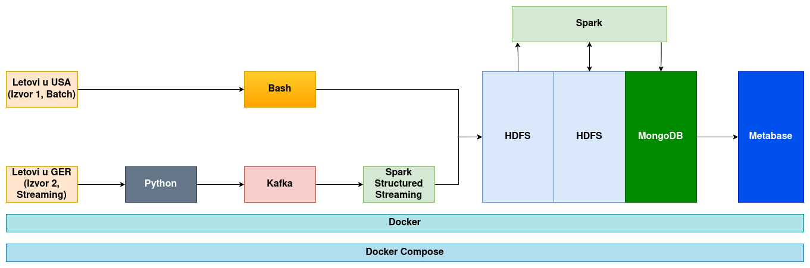

# BD-Flight-Analysis

## Ukratko o projektu

- Predmet: Arhitekture sistema velikih skupova podataka
- Student: Branislav Ristić
- Tema: Analiza podataka o letovima
- Opis projekta:
    - Cilj projekta je analiza podataka o letovima. Podaci se obrađuju u realnom vremenu i u batch režimu. 
    - Podaci se čuvaju u HDFS-u i MongoDB bazi podataka.
    - Za obradu podataka koristi se Spark.
        - Ukupno 10 upita se izvršava nad podacima.
    - Za streaming obradu podataka koristi se Spark Structured Streaming.
        - Ukupno 5 upita se izvršava nad podacima.
    - Za vizuelizaciju se koristi Metabase.
    - Projekat se pokreće u Docker kontejnerima.
- Prezentacija projekta sa prve kontrolne tačke: 
    - [Prezentacija](https://docs.google.com/presentation/d/1P79nNnO7AUsNYs-LHnNLSZEaTdVp11BhIKNGegL6q8M/edit#slide=id.p)

## Korišćeni podaci

- Korišćeni podaci su preuzeti sa [Kaggle](https://www.kaggle.com/).

- Skupovi podataka (oba pod CC BY 4.0 Deed licencom):
    - Batch:
        - [Flight prices](https://www.kaggle.com/datasets/dilwong/flightprices)
    - Streaming:
        - [German Air Fares](https://www.kaggle.com/datasets/darjand/domestic-german-air-fares)

## Struktura projekta

- Struktura repozitorijuma:
    - `batch/` - skripte za batch obradu podataka
    - `config/` - konfiguracioni fajlovi za Hadoop
    - `diagrams/` - dijagrami arhitekture
    - `producer/` - Kafka producer aplikacija
    - `sample_data/` - podaci namenjeni za obradu
    - `scripts/` - skripte za pokretanje obrađivanja podataka
        - `hdfs/` - skripte za rad sa HDFS-om
            - `put.sh` - skripta za uploadovanje podataka na HDFS
        - `kafka/` - skripte za rad sa Kafka-om
            - `create_topics.sh` - skripta za kreiranje Kafka topika
        - `mongo/` - skripte za rad sa MongoDB-om
            - `mongo.sh` - skripta generalnu manipulaciju sa MongoDB-om
        - `spark/` - skripte za rad sa Spark-om
            - `batch/` - skripte za pokretanje batch obrade
                - `transform.sh` - skripta za transformaciju podataka
                - `queryX.sh` - skripte za pokretanje određenog upita
            - `streaming/` - skripte za pokretanje streaming obrade
                - `queryX.sh` - skripte za pokretanje
    - `streaming/` - skripte za streaming obradu podataka
    - `docker-compose.yaml` - konfiguracioni fajl za pokretanje klastera
    - `prepare.sh` - skripta za pripremu okruženja
    - `README.md` - opis projekta
    - `run.sh` - skripta za pokretanje klastera

- Dijagram arhitekture:

\

## Pokretanje projekta

1. Klonirati repozitorijum.
2. Pozicionirati se u koreni direktorijum repozitorijuma.
3. Pokrenuti docker kontejnere komandom `docker compose up --build`.
4. Napraviti korisnika (ručno) u MongoDB bazi podataka u okviru `mongo.sh` skripte.
5. Podesiti MetaBase aplikaciju.
6. Pokrenuti skriptu `prepare.sh`.
7. Pokrenuti skriptu `run.sh`.

## Upiti

### Batch upiti

1. Odrediti cenu najskupljeg leta za svaki od polaznih aerodroma.
2. Za svaki aerodrom, odrediti na dan 17.04. prosečan broj slobodnih mesta ka aerodromu u Bostonu.
3. Odrediti 10 najskuplje zabeleženih letova.
4. Odrediti 10% najskuplje zabelenih letova.
5. Odredti prosečan iznos taksi i naknada za letove iz Los Anđelesa.
6. Odrediti aerodrom sa najvećim brojem sletanja.
7. Odrediti broj letova koji koji su poletali između 00:00 i 04:00.
8. Odrediti parove od-do aerodroma sa najmanjim trajanjem putivanja, uključiti i one koji imaju do 5 minuta razlike.
9. Odrediti razlike u cenama između uzastopnih merenja letova.
10. Odrediti merenja letova koja imaju cenu veću nego u proseku 3 prethodna merenja. Koristeći te podatke izračunati koliko bi se novaca potrošilo na takve letove kada bi se kupila po jedna karta.
11. Odrediti odnos merenja ekonomske klase za svaki od polaznih aerodroma.

### Streaming upiti

1. Odrediti najzastupljeniji od-do par aerodroma koristeći klizeći prozor od 30 sekundi sa korakom od 5 sekundi.
2. Odrediti 5 letova sa najmanjem trajanjem putovanja.
3. Odrediti letove koji nemaju presedanja, koristeći klizeći prozor od 30 sekundi sa korakom od 10 sekundi.
4. Odrediti maksimalnu cenu leta za svaki od polaznih aerodroma koristeći kotrljajući prozor širine 30 sekundi.
5. Izračunati prosečnu cenu letova za svaku aero-kompaniju koristeći kotrljajući prozor širine 30 sekundi.